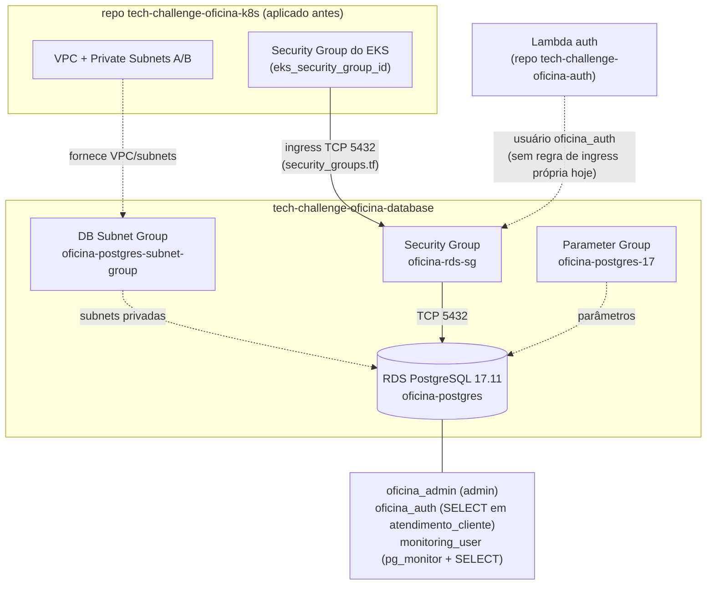

# Tech Challenge Oficina — Database

Infraestrutura como código (Terraform) do **Amazon RDS PostgreSQL 17** da API da Oficina — Tech Challenge FIAP, Fase 3, Grupo 80. Provisiona a instância RDS, o DB Subnet Group, o Security Group, o Parameter Group customizado, monitoramento (Performance Insights, CloudWatch, `pg_stat_statements`) e os scripts SQL dos usuários dedicados do banco.

Este repositório **não cria rede**: recebe VPC, subnets privadas e o Security Group do EKS do repositório `tech-challenge-oficina-k8s` por variável Terraform (veja [Como executar](#como-executar)). A aplicação Django (repo `tech-challenge-oficina`, rodando no EKS) conecta com o usuário `oficina_admin`/aplicação; a Lambda de autenticação (repo `tech-challenge-oficina-auth`) foi desenhada para usar o usuário restrito `oficina_auth`; a observabilidade usa `monitoring_user`.

## Tecnologias

| Categoria | Item | Fonte |
| --- | --- | --- |
| Banco de dados | PostgreSQL 17.11 | `terraform/rds.tf` (`engine_version`) |
| Infraestrutura como código | Terraform `>= 1.5.0` | `terraform/versions.tf` |
| Provider | `hashicorp/aws` (lock em `6.61.0`) | `terraform/versions.tf`, `terraform/.terraform.lock.hcl` |
| AWS | Amazon RDS (`aws_db_instance`) | `terraform/rds.tf` |
| AWS | DB Subnet Group (`aws_db_subnet_group`) | `terraform/subnet_group.tf` |
| AWS | Security Group (`aws_security_group`, `aws_vpc_security_group_ingress_rule`) | `terraform/security_groups.tf` |
| AWS | DB Parameter Group (`aws_db_parameter_group`) | `terraform/parameter-group.tf` |
| AWS | CloudWatch Logs + Performance Insights | `terraform/rds.tf` |
| CI/CD | GitHub Actions (`ci.yml`, `cd.yml`) | `.github/workflows/` |
| Segurança de IaC | Checkov (`soft-fail`) | `.github/workflows/ci.yml`, `.github/workflows/cd.yml` |

Não há integração com AWS Secrets Manager nem com New Relic no código deste repositório — as credenciais (`db_username`/`db_password`) são passadas como variáveis Terraform `sensitive`, e os usuários de aplicação são criados pelos scripts em `scripts/*.sql`.

## Arquitetura



O Security Group (`terraform/security_groups.tf`) hoje libera a porta `5432` apenas para o Security Group recebido via `eks_security_group_id`; não existe uma regra de ingress dedicada para a Lambda de autenticação neste código — o acesso dela depende de estar na mesma origem autorizada ou de uma regra equivalente ainda não versionada aqui. `oficina_admin`, `oficina_auth` e `monitoring_user` são usuários do PostgreSQL (não do IAM), criados via SQL manual (`scripts/auth_user.sql`, `scripts/monitoring_user.sql`) — `oficina_admin` é o `db_username` do próprio `aws_db_instance`.

Mais detalhe operacional (rede, controle de acesso, observabilidade) está em [`docs/architecture.md`](./docs/architecture.md) e nos [ADRs](./docs/adrs/README.md).

## Modelo de dados

Este repositório não define o schema da aplicação — ele só cria o banco e os usuários. A justificativa formal da escolha do PostgreSQL e o diagrama entidade-relacionamento estão no repositório da aplicação: [`docs/justificativa-banco-dados.md`](https://github.com/helyomendesdev/tech-challenge-oficina/blob/main/docs/justificativa-banco-dados.md).

As tabelas principais (schema `public`, criadas pela aplicação Django via migrations) são `atendimento_cliente`, `atendimento_veiculo`, `atendimento_ordemservico` e `atendimento_servico`, encadeadas em relacionamentos 1:N (um cliente tem vários veículos e ordens de serviço; uma ordem de serviço tem vários serviços). É contra `atendimento_cliente` que o script `scripts/auth_user.sql` concede `SELECT` ao usuário `oficina_auth`.

## Como executar

### Pré-requisitos

* Terraform `>= 1.5.0` ([`terraform/versions.tf`](./terraform/versions.tf));
* Credenciais AWS válidas (AWS Academy Learner Lab) exportadas no shell ou via `aws configure`;
* O repositório `tech-challenge-oficina-k8s` **já aplicado** — este Terraform não cria VPC nem subnets, ele as recebe por variável (`vpc_id`, `private_subnet_ids`, `eks_security_group_id` em [`terraform/variables.tf`](./terraform/variables.tf), sem valor `default`).

### Ordem de aplicação

1. Aplicar `tech-challenge-oficina-k8s` e coletar os outputs `vpc_id`, `private_subnet_ids` e o Security Group dos nodes do EKS (não o `oficina-eks-sg`, conforme o comentário em [`terraform/terraform.tfvars.example`](./terraform/terraform.tfvars.example));
2. Preencher um `terraform.tfvars` a partir de [`terraform/terraform.tfvars.example`](./terraform/terraform.tfvars.example) com esses valores mais `db_name`, `db_username`, `db_password` e `db_instance_class`;
3. Rodar este repositório (`terraform/`).

### Terraform

```bash
cd terraform
terraform init
terraform plan -var-file="terraform.tfvars"
terraform apply -var-file="terraform.tfvars"
```

Variáveis obrigatórias (sem `default`, ver `terraform/variables.tf`): `vpc_id`, `private_subnet_ids`, `db_name`, `db_username`, `db_password`, `eks_security_group_id`. `aws_region` (default `us-east-1`) e `db_instance_class` (default `db.t3.micro`) são opcionais.

### Endpoint e conexão

```bash
terraform output rds_endpoint
terraform output rds_port
```

Teste de conexão a partir de um host com rede até a VPC (por exemplo, um pod no EKS ou um bastion):

```bash
psql "host=$(terraform output -raw rds_endpoint) port=$(terraform output -raw rds_port) dbname=oficina user=oficina_admin sslmode=require"
```

### Destruição

```bash
terraform destroy -var-file="terraform.tfvars"
```

`deletion_protection = false` e `skip_final_snapshot = true` (`terraform/rds.tf`) permitem destruir a instância sem snapshot final — configuração adotada para o ciclo de testes do AWS Academy, não recomendada em produção.

## Deploy via CI/CD

* **CI** (`.github/workflows/ci.yml`): roda em `pull_request` e `push` para `develop`/`main`. Valida arquivos obrigatórios do repositório, formata (`terraform fmt -check -recursive`), inicializa e valida cada diretório com `.tf` (`terraform init -backend=false` + `validate`) e roda Checkov em modo `soft-fail`.
* **CD** (`.github/workflows/cd.yml`): dispara em `push` para `main`/`develop` ou manualmente (`workflow_dispatch`). Executa Checkov, `terraform validate`, depois `terraform plan` e `terraform apply` (auto-approve) usando um backend S3 + DynamoDB (`TF_STATE_BUCKET`, `TF_LOCK_TABLE`) e workspace nomeado pela branch (`github.ref_name`), com credenciais vindas de secrets do GitHub (`AWS_ACCESS_KEY_ID`, `AWS_SECRET_ACCESS_KEY`, `AWS_SESSION_TOKEN`, `AWS_REGION`).
* O job `terraform-apply` só roda após `terraform-plan` ter sido aprovado, e usa o `environment` do GitHub nomeado pela branch — o que permite exigir aprovação manual antes do apply.

## Operação: usuários, parâmetros, criptografia e monitoramento

| Usuário | Origem | Permissão | Consumidor |
| --- | --- | --- | --- |
| `oficina_admin` | `var.db_username` no `aws_db_instance` | administrador do RDS | Terraform / operação |
| `oficina_auth` | `scripts/auth_user.sql` | `CONNECT` + `SELECT` em `atendimento_cliente` | Lambda de autenticação |
| `monitoring_user` | `scripts/monitoring_user.sql` | `CONNECT`, `SELECT` em todas as tabelas do schema `public`, role `pg_monitor` | ferramentas de observabilidade |

O Parameter Group `oficina-postgres-17` (`terraform/parameter-group.tf`, família `postgres17`) define `shared_preload_libraries = pg_stat_statements`, `log_min_duration_statement = 1000`, `pg_stat_statements.track = all` e `track_io_timing = 1`. Ele **não** sobrescreve o parâmetro `rds.force_ssl` — o código não define esse parâmetro, então a instância usa o valor padrão do RDS para a família `postgres17`.

Criptografia e backup (`terraform/rds.tf`): `storage_encrypted = true`, `backup_retention_period = 7` (dias), `copy_tags_to_snapshot = true`. Monitoramento: `performance_insights_enabled = true` (retenção de 7 dias) e `enabled_cloudwatch_logs_exports = ["postgresql"]`; o Enhanced Monitoring do RDS não foi implementado por restrição de IAM do AWS Academy ([ADR-010](./docs/adrs/ADR-010-limitacoes-do-aws-academy.md)).

Detalhe completo de cada item (justificativas, alternativas consideradas, limitações) está em [`docs/architecture.md`](./docs/architecture.md) e nos ADRs correspondentes ([ADR-004](./docs/adrs/ADR-004-criptografia-e-backups-do-rds.md), [ADR-005](./docs/adrs/ADR-005-monitoramento-e-observabilidade-do-postgresql.md), [ADR-006](./docs/adrs/ADR-006-usuario-dedicado-monitoramento.md), [ADR-007](./docs/adrs/ADR-007-usuario-restrito-para-autenticacao.md), [ADR-008](./docs/adrs/ADR-008-parameter-group-customizado.md)).

## Documentação da API (Swagger / Postman)

Este repositório não expõe API — ele só provisiona o banco. O Swagger da aplicação fica em `/api/schema/swagger-ui/`, exposto pelo repo `tech-challenge-oficina` (localmente em `http://localhost:8000/api/schema/swagger-ui/`, e em produção pelo caminho equivalente atrás do API Gateway/ALB). A collection Postman (`postman_collection.json`, com environment `postman_environment.json`) também está nesse repositório.

## Limitações do ambiente (AWS Academy)

O ambiente é o AWS Academy Learner Lab, com permissões IAM restritas. Consequências registradas nos ADRs:

* Enhanced Monitoring do RDS não implementado (falta de permissão para criar a IAM Role necessária) — [ADR-010](./docs/adrs/ADR-010-limitacoes-do-aws-academy.md);
* `deletion_protection = false` e `skip_final_snapshot = true`, para permitir destruir/recriar o ambiente durante o desenvolvimento — [ADR-004](./docs/adrs/ADR-004-criptografia-e-backups-do-rds.md);
* Integração entre `tech-challenge-oficina-k8s` e este repositório é manual, por variáveis/outputs, sem Terraform Remote State compartilhado — [ADR-009](./docs/adrs/ADR-009-integracao-entre-repositorios-por-variaveis-e-outputs.md).

## Documentação (ADRs)

Decisões arquiteturais completas em [`docs/adrs/`](./docs/adrs/README.md):

1. [ADR-001 — Utilização do Amazon RDS com PostgreSQL](./docs/adrs/ADR-001-utilizacao-amazon-rds-postgresql.md)
2. [ADR-002 — RDS em subnets privadas](./docs/adrs/ADR-002-rds-em-subnets-privadas.md)
3. [ADR-003 — Acesso ao RDS restrito ao EKS](./docs/adrs/ADR-003-acesso-rds-restrito-ao-eks.md)
4. [ADR-004 — Criptografia e backups do RDS](./docs/adrs/ADR-004-criptografia-e-backups-do-rds.md)
5. [ADR-005 — Monitoramento e observabilidade do PostgreSQL](./docs/adrs/ADR-005-monitoramento-e-observabilidade-do-postgresql.md)
6. [ADR-006 — Usuário dedicado para monitoramento](./docs/adrs/ADR-006-usuario-dedicado-monitoramento.md)
7. [ADR-007 — Usuário restrito para autenticação](./docs/adrs/ADR-007-usuario-restrito-para-autenticacao.md)
8. [ADR-008 — Parameter Group customizado](./docs/adrs/ADR-008-parameter-group-customizado.md)
9. [ADR-009 — Integração entre repositórios por variáveis e outputs](./docs/adrs/ADR-009-integracao-entre-repositorios-por-variaveis-e-outputs.md)
10. [ADR-010 — Limitações do AWS Academy](./docs/adrs/ADR-010-limitacoes-do-aws-academy.md)

Fluxo de contribuição e regras de branch em [`CONTRIBUTING.md`](./CONTRIBUTING.md).

## Repositórios relacionados

| Repositório | Responsabilidade |
| --- | --- |
| [`tech-challenge-oficina`](https://github.com/helyomendesdev/tech-challenge-oficina) | Aplicação Django, Docker, CI/CD e observabilidade |
| [`tech-challenge-oficina-k8s`](https://github.com/helyomendesdev/tech-challenge-oficina-k8s) | VPC, EKS, ECR, ALB, Terraform e Kubernetes |
| [`tech-challenge-oficina-database`](https://github.com/helyomendesdev/tech-challenge-oficina-database) | Este repositório — RDS PostgreSQL e configuração do banco |
| [`tech-challenge-oficina-auth`](https://github.com/helyomendesdev/tech-challenge-oficina-auth) | API Gateway, Lambda e autenticação |

## Status

* [x] Amazon RDS PostgreSQL 17.11, DB Subnet Group e Security Group provisionados por Terraform;
* [x] Parameter Group customizado (`pg_stat_statements`, `log_min_duration_statement`, `track_io_timing`);
* [x] Criptografia do storage e backups com retenção de 7 dias;
* [x] Performance Insights e exportação de logs para CloudWatch;
* [x] Usuários `oficina_auth` e `monitoring_user` com permissões restritas (scripts SQL);
* [x] Outputs para integração com os demais repositórios;
* [x] Documentação de arquitetura e ADRs;
* [ ] Regra de ingress dedicada para a Lambda de autenticação no Security Group (hoje só o SG do EKS está liberado);
* [ ] Enhanced Monitoring (bloqueado por IAM do AWS Academy).
